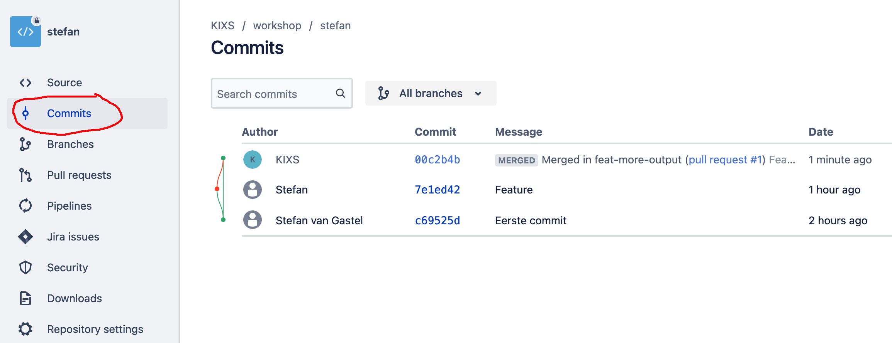

Met zowel de `master` als `feature` branch op Bitbucket kunnen we een `pull-request` gaan aanmaken.

**Opdracht**

1) Op je Bitbucket **repository** pagina, kies je in het grijze menu links voor `Pull requests`. 

2) Klik rechts bovenin op `Create pull request`

3) Als het goede is opent nu het `Create pull request` scherm en wordt er automatisch al de juiste `source` en `destination` branch ingevuld (`feat-more-output` > `master`)

4) Vul eventueel wat zaken in, het minimale staat er al

5) Maak het `pull request` aan

6) Je komt nu in het `Pull request` scherm, kijk hier vooral even rond

> Optioneel kun je nog extra commits doen in je lokale `feature` branch en deze ook nog pushen

7) Merge het `pull request`, kies ook hier optioneel voor `Close source branch`

> Tip: Mergen duurt even op Bitbucket.org #geduld

8) Als de merge is uitgevoerd zul je in bijv. het `Commits` overzicht (links in het menu) een mooie visualisatie zien van wat er zojuist heeft plaats gevonden:

Ga door naar de volgende stap.

