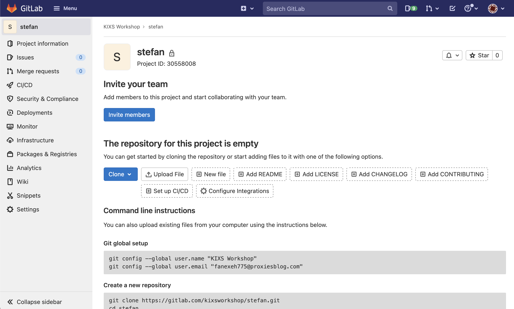

In deze opdracht gaan we aan de slag met [**Gitlab**](https://gitlab.com/) als gecentraliseerd platform voor onze git repository. We gaan gebruik maken van gegevens die de trainer vertrekt. Indien je deze workshop zelfstandig uitvoert dien je zelf een Gitlab account aan te maken.

**Opdracht**

1) Ga naar [https://gitlab.com](https://gitlab.com) en log in met de gegevens die je van de trainer hebt ontvangen (knop Login rechts bovenin).

> Je komt nu op de Gitlab overview voor deze gebruiker.

2) In de paarse verticale balk bovenin op het scherm kun je (in het midden) op het `+` icoon klikken. Kies nu voor `New project/repository`.

3) Kies nu de tegel links bovenin: `Create blank project`

4) Zorg dat je de volgende **afwijkende** velden invult (de rest mag blijven zoals het is):
* Project name: `(je eigen voornaam)`
* Initialize repository with a README: `Uitvinken` !

5) Maak de repo aan met `Create project`

> Als het goed is ziet de homepage van je **lege** project (repository) er ongeveer zoals hieronder uit. In de volgende stap gaan we je code uploaden naar deze repository.

Ga door naar de volgende stap.
