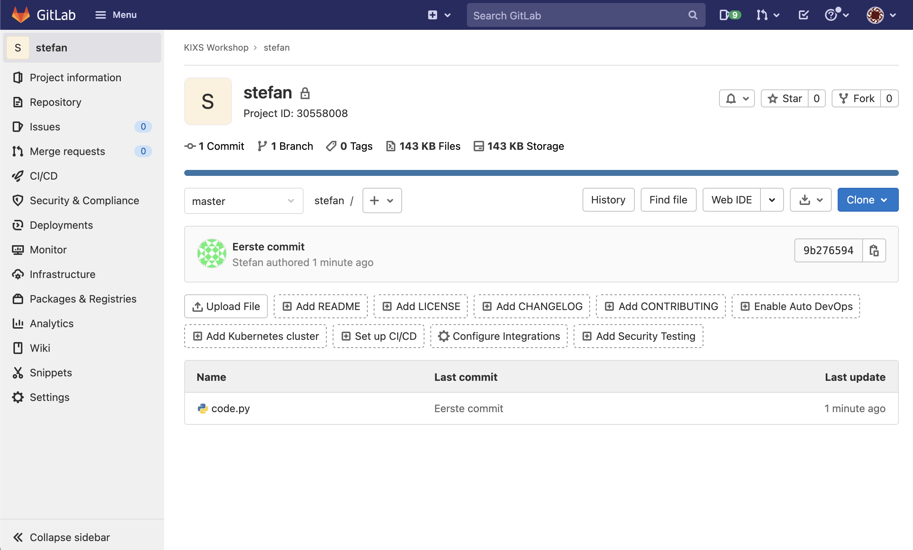

De `origin` is toegevoegd aan de lokale repository. Tijd om je code toe te voegen, te committen en naar je `origin` te sturen.

**Opdracht**

1) Voeg je code (`code.py`) toe aan de git `staging` omgeving.

2) Commit je code in de `master` branch. 
> (Tip: gebruik je gewone naam en bijv. een fictief email adres bij de vraag om identiteit)

3) Push de `master` branch naar de `origin` upstream.

4) Check of je code inderdaad te zien is in je Bitbucket repository (misschien even pagina verversen). Dat moet er ongeveer zo uit zien:

Ga door naar de volgende stap.