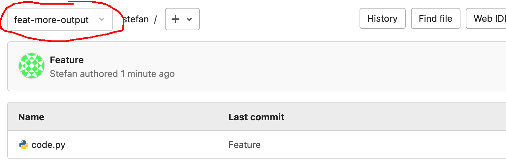

Nu je lokale repo gekoppeld is aan de `remote` repo en er code naar de `remote` is gestuurd kunnen we met (`feature`) `branches` en `merge-requests` aan de slag!

**Opdracht**

1) Maak een nieuwe feature branch aan genaamd `feat-more-output`

2) Pas je code aan

3) Commit je code

4) Push de nieuwe branch naar de `origin`

> Nu zou ook de nieuwe branch op Gitlab te zien moeten zijn, met de aangepaste code (selecteer wel de nieuwe branch):

Ga door naar de volgende stap.

