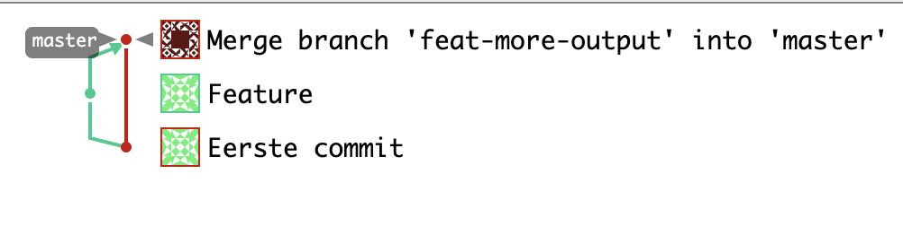

Met zowel de `master` als `feature` branch op Bitbucket kunnen we een `pull-request` gaan aanmaken.

**Opdracht**

1) Op je Gitlab **repository** pagina, kies je in het grijze menu links voor `Merge requests`. 

2) Klik midden onderin  op `New merge request`

3) Als het goede is opent nu het `New merge request` scherm. Vul de de juiste `source` en `target` branch in (`feat-more-output` > `master`)

4) Klik op de `Compare branches and continue` knop

5) Vul in het volgende scherm eventueel wat als beschrijving in en klik daarna op `Create merge request`

6) Je komt nu in het `Merge request` scherm, kijk hier vooral even rond

> Optioneel kun je nog extra commits doen in je lokale `feature` branch en deze ook nog pushen

7) Merge het `Merge request`, kies ook hier optioneel voor `Delete source branch`

8) Als de merge is uitgevoerd zul je in bijv. het `Repository` -> `Graph` overzicht (links in het menu) een mooie visualisatie zien van wat er zojuist heeft plaats gevonden:

Ga door naar de volgende stap.

